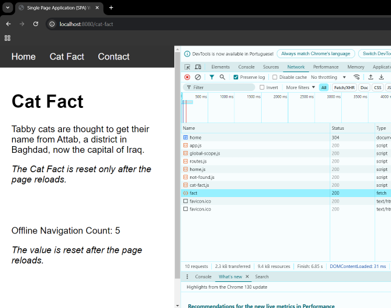

# 👨‍🎓📖 SPA with Pure JavaScript

This project is a Single Page Application (SPA) built using pure HTML, CSS, and JavaScript. It demonstrates client-side routing and rendering without relying on any front-end frameworks or libraries.

It is 🚫 **NOT** intended for 🪲 **production usage**! It's simple and hackable enough to be used for 👨‍🎓 **Learning Purposes**.

> ⚠️ **Note**: this webapp depends on [catfact.ninja API](https://catfact.ninja/). See: [cat-fact.js](src/pages/cat-fact/cat-fact.js#L7)

## 🏃‍♂️TL;DR

View the website hosted on AWS S3: http://spa-with-pure-javascript.s3-website-us-east-1.amazonaws.com

## ✨ Features

- **Dynamic Page Loading:** Pages (home and cat fact) are dynamically loaded into a single content area without reloading the entire page.
- **Back/Forward Navigation:** Properly handles the browser's back and forward buttons, ensuring seamless navigation between pages.
- **Nginx Setup:** Dockerized with an Nginx configuration for serving the SPA.
- **User Navigation Count:** Tracks offline navigation within the SPA and page reloads.

    1. Displays the count of offline navigations (i.e., page changes within the SPA without a full page reload). The value is updated by JavaScript in the app.js file, incrementing each time navigation occurs within the SPA.

    2. Displays the number of times the page has been reloaded since the session began. This value is managed using sessionStorage, incrementing each time the page is reloaded. The updated value is reflected in the page, as shown in both the `app.js` and `contact.html` files.

## 📁 Project Structure

```bash
src/
│   ├── index.html           # Main entry point of the app  
│   ├── 404.html             # Redirect to index.html, necessary when running with http-server (npm package)
│   ├── contact.html         # A normal HTML page
│   ├── app/                 # JavaScript logic
│   │    └── app.js          # Main SPA logic, including navigation and route handling
│   │    └── routes.js       # Class responsible for routing and loading page content
│   └── pages/               # HTML pages for different routes
│      ├── home/
│      │   └── home.js       # Home page content
│      ├── about/
│      │   └── about.js      # About page content
│      └── not-found/
│          └── not-found.js  # Fallback page content (404)
├── docker-compose.yml       # Docker Compose configuration
├── Dockerfile               # Dockerfile for containerizing the app
├── nginx.conf               # Nginx configuration
```

## 🚀 Getting Started

### Prerequisites

- 🐳 Docker and Docker Compose installed on your machine to run in a container.
- 🟢 Node to run with NPM.

### ⚙️ Installation

Install Docker or Node.js:

[Install Docker](https://www.docker.com/) 

[Install Node](https://nodejs.org/)

Clone the repository:

```
git clone https://github.com/elidaniel92/spa-with-pure-js.git
```

Switch to the repository folder:

```
cd spa-with-pure-js
```

### 🐳 Running Locally with Docker

Start the app using Docker Compose.

Build the Nginx Container Image:
```
docker-compose build
```

Started the container:
```
docker-compose up
```

### 🟢 Running Locally with http-server

[http-server](https://www.npmjs.com/package/http-server) is a simple command-line static HTTP server. 

Install http-server with npm:

```
npm install --global http-server
```

Run on port 8080:

```
http-server ./src --port 8080
```

### 🎉 Open your browser and navigate to http://localhost:8080 to view the application.

#### 💡 Tip: Use Chrome DevTools (press F12) to understand how the files are loaded.




# 📜 License

This project is licensed under the MIT License - see the [LICENSE](./LICENSE) file for details.